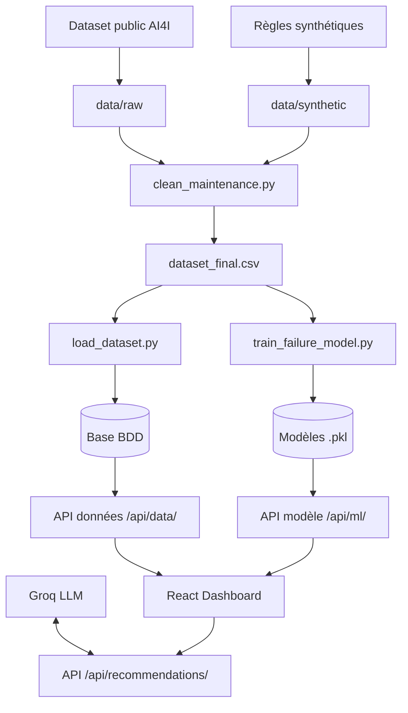

# RAPPORT 1 : RAPPORT DE PROJET PRINCIPAL
## Maintenance Prédictive & Optimisation des Pièces de Rechange Automobile

**Auteur** : Candidate Titre RNCP "Développeur en IA"  
**Établissement** : Simplon / ECE  
**Projet** : `predictive-maintenance-parts`  
**Version** : 1.0 — 2026  

---

## TABLE DES MATIÈRES

1. **Présentation du Projet & Contexte Industrial**
2. **Cahier des Charges, Personas & User Stories (C14)**
3. **Spécifications, Collecte (C1), Nettoyage (C3) & Validation des Données**
4. **Analyse SQL Métier & Exploitation des Données (C2)**
5. **Base de Données Relationnelle (C4) — Modélisation MPD, SGBD & Importation**
6. **Registre & Conformité RGPD (C4)**
7. **API REST de Mise à Disposition des Données (C5) — Architecture, Sécurité JWT & OpenAPI**
8. **Cadre Technique & Architecture Globale (C15) — Diagrammes de Séquence, Dépendances & Évaluation POC**
9. **Interfaces Web & Composants React (C17) — Formulaires, Accessibilité WCAG & Contrôle des Droits**
10. **Conduite de Projet Agile & Traçabilité (C16)**

---

## 1. PRÉSENTATION DU PROJET & CONTEXTE INDUSTRIEL

Dans le secteur industriel automobile, la gestion de la maintenance des équipements de production et la gestion des stocks de pièces détachées représentent des enjeux financiers et opérationnels majeurs. 

Une usine de fabrication automobile fait face à deux risques majeurs :
1. **Les pannes imprévues des machines** : L'arrêt d'une chaîne de production génère des coûts d'immobilisation élevés et des retards de livraison.
2. **Le sur-stockage ou la rupture de pièces détachées** : Le stockage excessif de pièces dormant immobilise de la trésorerie, tandis qu'une rupture de stock prolonge les durées de panne.

Le projet **Maintenance Prédictive & Optimisation des Pièces de Rechange** apporte un système d'aide à la décision centralisé permettant de :
- Prédire les défaillances des équipements à partir des télémesures de capteurs industriels.
- Prévoir la demande future en pièces détachées pour ajuster les niveaux de réapprovisionnement.
- Restituer les indicateurs clés (KPI) et offrir des recommandations synthétiques aux équipes opérationnelles.

---

## 2. CAHIER DES CHARGES, PERSONAS & USER STORIES (C14)

### 2.1. Personas Cibles
L'application s'adresse à 3 profils d'utilisateurs distincts :

| Persona | Rôle applicatif | Besoin principal |
|---|---|---|
| **Amine, technicien de maintenance** | `technicien` | Vérifier rapidement si un équipement présente un risque de panne avant intervention |
| **Sophie, gestionnaire de stock** | `gestionnaire_stock` | Anticiper la demande de pièces et éviter les ruptures de stock |
| **Karim, administrateur système** | `admin` | Superviser l'ensemble du système (utilisateurs, données, monitoring) |

### 2.2. User Stories & Critères d'Acceptation Testables

- **US-1 (Technicien Amine — Prédire le risque de panne)** :
  - *En tant que* technicien, *je veux* saisir les mesures capteur d'une machine, *afin de* décider si une intervention préventive est nécessaire.
  - *Critères d'acceptation* :
    1. Réponse de l'API ML reçue en moins de 2 secondes.
    2. Affichage visuel d'un badge de risque (`faible`, `moyen`, `élevé`) avec code couleur.
    3. Accessibilité WCAG : carte d'alerte balisée avec `role="alert"` et `aria-label`.

- **US-2 (Gestionnaire Sophie — Consulter les pièces sous seuil)** :
  - *En tant que* gestionnaire de stock, *je veux* consulter la liste des pièces sous le seuil de réapprovisionnement, *afin de* commander les volumes nécessaires.
  - *Critères d'acceptation* :
    1. Filtrage instantané via l'endpoint `/api/data/pieces/sous_seuil/`.
    2. Formulaire d'ajustement de stock strictement réservé aux rôles `gestionnaire_stock` et `admin` (rejet HTTP 403 pour les techniciens).

- **US-3 (Gestionnaire Sophie — Prévoir la demande de pièces)** :
  - *En tant que* gestionnaire de stock, *je veux* sélectionner une pièce et obtenir la prévision de demande pour le mois suivant, *afin de* valider le besoin de réapprovisionnement.

- **US-4 (Tous rôles — Authentification sécurisée)** :
  - *En tant qu'*utilisateur, *je veux* m'authentifier avec un compte personnel, *afin de* protéger les données de l'entreprise.

- **US-5 (Administrateur Karim — Supervision système)** :
  - *En tant qu'*administrateur, *je veux* consulter la santé de l'API et les statistiques du modèle, *afin de* vérifier le bon fonctionnement du système.

---

## 3. SPÉCIFICATIONS, COLLECTE (C1), NETTOYAGE (C3) & VALIDATION DES DONNÉES

### 3.1. Collecte Automatisée (C1)
La collecte combine deux sources de données complémentaires :
1. **Source publique réelle** : *AI4I 2020 Predictive Maintenance Dataset* (UCI Machine Learning Repository, ID 601, 10 000 lignes capteurs).
2. **Source synthétique métier** : Génération automatisée des pièces détachées, fournisseurs et historiques d'interventions.

- **Script de collecte** : [`src/collect/download_ai4i.py`](file:///d:/predictive-maintenance-parts/src/collect/download_ai4i.py)
- **Robustesse** : Stratégie à 2 niveaux (appel API `ucimlrepo`, repli automatique HTTP direct si échec réseau) et journalisation dans `logs/collecte.log`.
- **Résultat** : 10 000 lignes enregistrées dans `data/raw/ai4i2020_raw.csv`.

### 3.2. Nettoyage & Agrégation (C3)
Le script [`src/clean/clean_maintenance.py`](file:///d:/predictive-maintenance-parts/src/clean/clean_maintenance.py) applique 4 règles métier documentées dans [`docs/cleaning_rules.md`](file:///d:/predictive-maintenance-parts/docs/cleaning_rules.md) :
1. Suppression des doublons stricts et détection des entrées corrompues.
2. Validation des bornes physiques capteurs (ex: Températures > 0 K, Vitesses ≥ 0 RPM).
3. Renommage normalisé au format `snake_case`.
4. Fusion et agrégation du jeu capteurs avec l'historique des interventions.

| Métrique | Avant nettoyage (`data/raw/`) | Après nettoyage (`data/processed/`) |
|---|---|---|
| **Nombre de lignes** | 10 000 lignes brutes | 10 025 lignes fusionnées |
| **Nombre de colonnes**| 14 colonnes | 22 colonnes |
| **Valeurs manquantes**| 0 (contrôlé) | 0 (100% exploitables) |

- **Contrôle Qualité Automatisé** : Script `src/clean/validate_dataset.py` couplé à 6 tests unitaire pytest (`tests/test_validate_dataset.py`) exécutés automatiquement en CI.

---

## 4. ANALYSE SQL MÉTIER & EXPLOITATION DES DONNÉES (C2)

5 requêtes SQL complexes et documentées sont rédigées dans [`src/sql/analysis_queries.sql`](file:///d:/predictive-maintenance-parts/src/sql/analysis_queries.sql) et exportées dans [`docs/query_results.md`](file:///d:/predictive-maintenance-parts/docs/query_results.md).

### Requête clé : Coût cumulé par pièce de rechange
```sql
SELECT p.nom AS piece, p.categorie,
       COUNT(ip.intervention_id) AS nb_interventions,
       SUM(ip.cout_total) AS cout_cumule
FROM interventions_pieces ip
JOIN pieces_rechange p ON p.piece_id = ip.piece_id
GROUP BY p.nom, p.categorie
ORDER BY cout_cumule DESC;
```

**Résultats de la requête** :
- Radiateur : 115 interventions | 52 826 €
- Alternateur : 95 interventions | 52 286 €
- Courroie de distribution : 98 interventions | 12 487 €
- Disque d'embrayage : 46 interventions | 5 420 €
- Capteur moteur : 1 intervention | 88 €

*(Ces résultats alimentent directement le graphique de coût du tableau de bord React).*

---

## 5. BASE DE DONNÉES RELATIONNELLE (C4) — MPD, SGBD & IMPORTATION

### 5.1. Modèle Physique de Données (MPD Merise)
La base de données repose sur 5 entités normalisées ([`docs/mcd_mpd.md`](file:///d:/predictive-maintenance-parts/docs/mcd_mpd.md)) :

```text
[User] (Compte, Hash, Rôle: admin/technicien/gestionnaire_stock)

[Fournisseur] (1) <─── (0,N) [PieceRechange] (1) <─── (0,N) [InterventionPiece]
                                                              ▲
[LectureCapteur] (0,1) <──────────────────────────────────────┘ (0,N)
```

### 5.2. Choix du SGBD & Intégrité
- **PostgreSQL 16** en environnement de Production / Docker (robustesse, concurrence).
- **SQLite** en environnement de Développement / CI (zéro-configuration, vitesse d'exécution).
- **Bascule transparente** via la variable d'environnement `DATABASE_URL`.
- **Intégrité référentielle** : Clés étrangères protégées contre les suppressions accidentelles (`PROTECT`), contraintes `CHECK` SQL sur les plages de valeurs.

### 5.3. Importation Reproductible
Commande Django atomique `python manage.py load_dataset --reset` :
```text
Tables videes.
Import termine : 5 fournisseurs, 5 pieces, 10 000 lectures, 355 interventions.
```

---

## 6. REGISTRE & CONFORMITÉ RGPD (C4)

Le document [`docs/rgpd.md`](file:///d:/predictive-maintenance-parts/docs/rgpd.md) établit la conformité réglementaire du projet :
- **Périmètre des données** : Les télémesures de capteurs et historiques d'interventions sont des données techniques industrielles (non personnelles, hors champ RGPD).
- **Données Utilisateurs (`User`)** : Minimisées au strict nécessaire (email, rôle, hash de mot de passe).
- **Sécurité & Conservation** : Mots de passe hachés avec algorithmes robustes (Argon2 / PBKDF2). Durée de conservation fixée à 3 ans avec procédure d'anonymisation documentée en 4 étapes.

---

## 7. API REST DE MISE À DISPOSITION DES DONNÉES (C5)

L'API développe sous **Django REST Framework** met à disposition les données du système :

| Endpoint | Méthode | Rôle & Fonction | Sécurité |
|---|---|---|---|
| `/api/health/` | GET | Vérification de l'état de l'API et de la BDD | Public |
| `/api/data/pieces/` | GET | Liste paginée du catalogue de pièces | Auth JWT |
| `/api/data/pieces/{id}/` | GET | Détail d'une pièce spécifique | Auth JWT |
| `/api/data/pieces/sous_seuil/` | GET | Filtre des pièces sous le seuil critique | Auth JWT |
| `/api/docs/` | GET | Documentation interactive OpenAPI / Swagger | Public |

### Démonstration de Sécurité JWT (Duo HTTP 401 / 200)
- **Appel sans token** : `GET /api/data/pieces/` ➜ `HTTP 401 Unauthorized` `{"detail":"Informations d'authentification non fournies."}`
- **Appel avec token JWT** : `GET /api/data/pieces/ -H "Authorization: Bearer <access_token>"` ➜ `HTTP 200 OK` avec la liste JSON paginée.

---

## 8. CADRE TECHNIQUE & ARCHITECTURE GLOBALE (C15)

### 8.1. Flux de Données et Inférence (Architecture)
Le document [`docs/architecture.md`](file:///d:/predictive-maintenance-parts/docs/architecture.md) formalise l'architecture globale :



### 8.2. Évaluation de la Preuve de Concept (POC)
- **Niveau atteint** : **BON** (Flux documenté, fonctionnel de bout en bout en environnement local et Docker Compose avec gestion d'erreurs).
- **Conclusion** : **CONTINUER** (Toutes les compétences visées disposent d'une preuve fonctionnelle validée).

---

## 9. INTERFACES WEB & COMPOSANTS REACT (C17)

### 9.1. Validation Client & Serveur
Dans [`src/frontend/src/components/PredictFailureForm.jsx`](file:///d:/predictive-maintenance-parts/src/frontend/src/components/PredictFailureForm.jsx), le formulaire applique des validations HTML5 natives (`min`, `max`, `step`, `required`) calquées sur les bornes des sérialiseurs backend :
- Température : 250.0 K à 350.0 K | Vitesse : 0 à 5000 RPM | Couple : 0 à 150 Nm.
- Les saisies invalides sont bloquées côté client avant l'envoi de la requête réseau (`rangeUnderflow`).

### 9.2. Contrôle d'Accès par Rôle (RBAC) & Accessibilité WCAG
- L'interface masque ou autorise les fonctionnalités selon le rôle extrait du jeton JWT.
- **Accessibilité WCAG** : 17 occurrences réelles de balises `aria-label`, `role="alert"` (pour la notification d'erreur) et `role="group"` (pour les cartes KPI).

---

## 10. CONDUITE DE PROJET AGILE & TRAÇABILITÉ (C16)

Le document [`docs/project_management.md`](file:///d:/predictive-maintenance-parts/docs/project_management.md) trace la conduite du projet :
- **Backlog priorisé** : Découpage par compétence (C1 à C21) avec statuts mis à jour selon l'historique réel `git log`.
- **Rôles par domaine** : Données, API données, Modèles IA, Interface, DevOps/CI.
- **Rituels Agiles adaptés** : Points d'avancement, revues fonctionnelles systématiques et rétrospectives formalisées après la résolution des incidents techniques.
