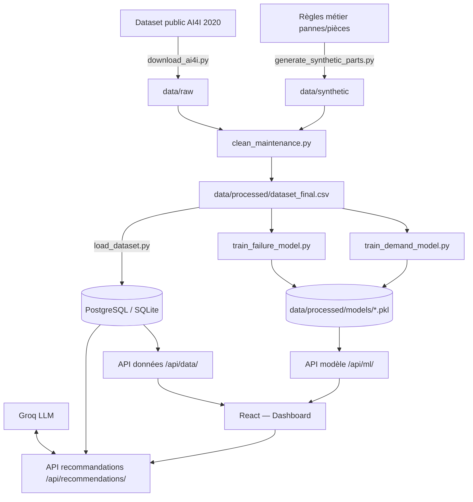

# Architecture technique (C15)

## Vue d'ensemble

## Justification des choix techniques

| Choix | Raison |
|---|---|
| **Django + DRF** | Écosystème mature pour l'authentification (JWT), l'ORM et la génération de documentation OpenAPI (`drf-spectacular`) — cohérent avec les compétences C4/C5/C9. |
| **Deux espaces d'API distincts** (`/api/data/` vs `/api/ml/`) | Le référentiel RNCP distingue explicitement C5 (mise à disposition des données) et C9 (exposition d'un modèle IA) — la séparation rend chaque compétence démontrable isolément. |
| **PostgreSQL (SQLite en local)** | PostgreSQL pour la robustesse en environnement conteneurisé (`docker-compose.yml`), SQLite comme repli zéro-configuration pour le développement rapide — bascule automatique via `DATABASE_URL`. |
| **React 19 + Vite** | Démarrage rapide, écosystème large, cohérent avec les compétences déjà démontrées sur les projets précédents analysés pour cet examen. |
| **scikit-learn / XGBoost pour les modèles maison** | Modèles interprétables (SHAP), légers, adaptés au volume de données du projet — pas besoin de deep learning pour ce périmètre. |
| **Groq pour les recommandations en langage naturel** | Voir `docs/benchmark_ia.md` — gratuit, latence faible, API compatible OpenAI (portabilité). |
| **Modèles chargés en lecture seule par le backend** (`ml_api/model_registry.py`) | Sépare clairement l'entraînement (hors ligne, `src/ml/`) de l'inférence (API), pattern MLOps standard qui évite de ré-entraîner un modèle à chaque requête. |

## Flux de données

1. **Collecte** (`src/collect/`) : dataset public + génération synthétique documentée.
2. **Nettoyage** (`src/clean/`) : fusion, validation, dataset final versionné dans son format (pas les données elles-mêmes, gitignorées).
3. **Stockage** (`load_dataset.py`) : import en base relationnelle.
4. **Entraînement** (`src/ml/`) : modèles sauvegardés en `.pkl`, hors du backend.
5. **Exposition** : deux APIs REST distinctes, authentifiées par JWT.
6. **Restitution** : dashboard React consommant les deux APIs + les recommandations IA.

## Preuve de concept

Le flux ci-dessus est **fonctionnel de bout en bout en environnement local** (vérifié : collecte réelle du dataset UCI, entraînement réel des deux modèles, API testée par requêtes HTTP réelles, interface testée par interactions réelles dans un navigateur — voir l'historique de commits pour le détail de chaque vérification). Un déploiement en environnement de pré-production distant (Render/Railway) est identifié comme approfondissement de Phase B, non bloquant pour la démonstration des compétences.

## Diagrammes complémentaires

- Modèle de données : voir les migrations Django (`src/backend/*/migrations/0001_initial.py`) qui font foi de MPD.
- Séquence d'une prédiction : Utilisateur → Frontend → `POST /api/ml/predict-failure/` → chargement modèle (cache) → réponse JSON → mise à jour de l'interface + journalisation (`ModelPredictionLog`).
