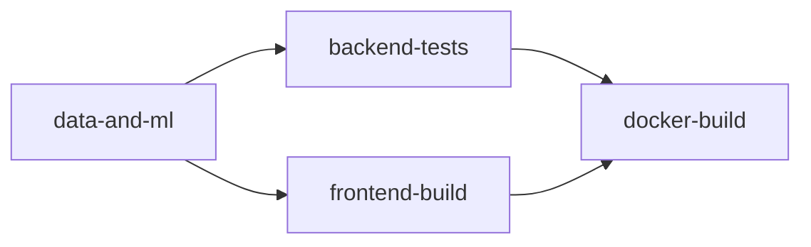

# Intégration et livraison continue (C13, C18, C19)

## Déclencheur

Le workflow `.github/workflows/ci.yml` se déclenche sur chaque `push` et chaque `pull_request`, quelle que soit la branche.

## Étapes (4 jobs séquencés par dépendances)



1. **`data-and-ml`** — rejoue la chaîne complète de données et d'entraînement à chaque exécution (téléchargement du dataset public, génération synthétique, nettoyage + validation, **6 tests pytest couche Données** — colonnes/valeurs manquantes/doublons/plages, requêtes SQL, entraînement des deux modèles), puis archive les `.pkl` obtenus comme artefact partagé avec les jobs suivants. C'est la preuve que le pipeline C1→C3→C9 est reproductible, pas seulement documenté.
2. **`backend-tests`** — installe les dépendances backend, lint (`ruff`), récupère les modèles entraînés par le job précédent, migre la base (SQLite en CI), exécute la suite `pytest` complète (**41 tests** : santé, auth, données, ML, règles métier, permissions, recommandations) avec rapport de couverture (`pytest-cov`, archivé comme artefact CI).
3. **`frontend-build`** — lint (`oxlint`), **tests (`npm test`, 4 tests Vitest + Testing Library)**, puis `npm run build` pour garantir que le frontend compile sans erreur.
4. **`docker-build`** — construit réellement les images Docker backend et frontend, puis démarre un conteneur du backend fraîchement construit et vérifie que `/api/health/` répond (test de fumée). C'est la preuve de packaging/livraison (C19), pas seulement un `Dockerfile` qui n'a jamais été construit.

*(Mis à jour le 05/08/2026 : cette section indiquait encore "29 tests" et ne mentionnait ni le lint backend, ni la couverture, ni les tests données/frontend en CI — corrigé pour refléter l'état réel après la vérification C18.)*

## Pourquoi rejouer tout le pipeline à chaque fois plutôt que de committer les `.pkl`

Les modèles entraînés ne sont **jamais versionnés** dans Git (gitignorés, voir `.gitignore`) : ils sont un artefact dérivé, reproductible à partir du code et des données. Les regénérer en CI garantit qu'un contributeur qui clone le dépôt obtient exactement la même chaîne fonctionnelle, sans dépendre d'un fichier binaire figé.

## Vérification locale équivalente

```bash
# Pipeline data + ML + tests couche Donnees (6 tests)
pip install -r requirements.txt
python src/collect/download_ai4i.py && python src/collect/generate_synthetic_parts.py
python src/clean/clean_maintenance.py && python src/clean/validate_dataset.py
python -m pytest tests/ -v
python src/ml/train_failure_model.py && python src/ml/train_demand_model.py

# Backend (41 tests + lint + couverture)
cd src/backend && pip install -r requirements.txt
python manage.py migrate
python -m pytest -v --cov=. --cov-report=term-missing
ruff check . --select=F,E9

# Frontend (lint + 4 tests + build)
cd src/frontend && npm ci && npm run lint && npm test && npm run build

# Packaging (necessite Docker Desktop demarre)
docker compose build
```

## Incident résolu — crash du conteneur backend au démarrage

Le job `docker-build` a échoué pendant plusieurs itérations sur son test de fumée (démarrage du conteneur backend construit, sondage de `/api/health/`), alors que les deux images se construisaient sans erreur. Diagnostic complet dans [`incident_report.md`](incident_report.md) ; résumé ici côté CI/CD.

**Cause** : `ml_api/model_registry.py` calculait inconditionnellement, au chargement du module, `Path(__file__).resolve().parents[3]` pour localiser les modèles entraînés en local. En conteneur, seul `src/backend/` est copié dans `/app/` (voir `Dockerfile`) : `/app` n'a que 2 niveaux de parents avant `/`, donc `parents[3]` lève `IndexError` — avant même que `ML_MODELS_DIR` (fourni explicitement dans le `docker run` du smoke test) ait la moindre chance d'être consulté, puisque le calcul n'était pas conditionné à son absence. Django plantait dès les vérifications système au démarrage, le conteneur sortait immédiatement (`Exited (1)`), et le sondage `/api/health/` échouait donc systématiquement après le timeout complet.

**Pourquoi ça n'était pas détecté en local avant** : en dehors de Docker, `parents[3]` reste valide (structure de dossiers complète du dépôt) — le bug n'existe que dans la structure aplatie du conteneur, jamais reproduit par `runserver` en local.

**Correction** : le calcul de repli est désormais dans une fonction `_resolve_models_dir()`, appelée seulement si `ML_MODELS_DIR` est absent — `parents[3]` n'est plus jamais évalué quand la variable d'environnement suffit (le cas du conteneur et de la CI).

**Vérification** (une fois Docker Desktop de nouveau disponible sur la machine de développement) :
- Reconstruction de l'image backend en local (`docker build`) : succès.
- Conteneur démarré avec exactement les mêmes variables d'environnement que le smoke test CI (`DJANGO_SECRET_KEY`, `DJANGO_DEBUG=0`, `DJANGO_ALLOWED_HOSTS`, `ML_MODELS_DIR=/app/models` + volume monté) : migrations appliquées sans erreur, conteneur reste `Up`.
- `curl http://localhost:8001/api/health/` → `{"status":"ok","checks":{"database":true,"groq_configured":false}}`.
- Confirmation définitive : le job `docker-build` sur GitHub Actions (voir section suivante pour la méthode de vérification sans connexion).
