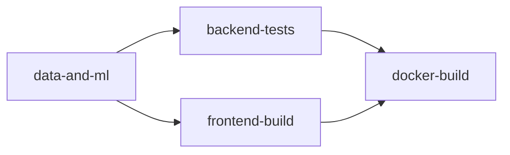

# Intégration et livraison continue (C13, C18, C19)

## Déclencheur

Le workflow `.github/workflows/ci.yml` se déclenche sur chaque `push` et chaque `pull_request`, quelle que soit la branche.

## Étapes (4 jobs séquencés par dépendances)



1. **`data-and-ml`** — rejoue la chaîne complète de données et d'entraînement à chaque exécution (téléchargement du dataset public, génération synthétique, nettoyage, requêtes SQL, entraînement des deux modèles), puis archive les `.pkl` obtenus comme artefact partagé avec les jobs suivants. C'est la preuve que le pipeline C1→C3→C9 est reproductible, pas seulement documenté.
2. **`backend-tests`** — installe les dépendances backend, récupère les modèles entraînés par le job précédent, migre la base (SQLite en CI) et exécute la suite `pytest` complète (29 tests : auth, données, ML, permissions, recommandations).
3. **`frontend-build`** — lint (`oxlint`) puis `npm run build` pour garantir que le frontend compile sans erreur.
4. **`docker-build`** — construit réellement les images Docker backend et frontend, puis démarre un conteneur du backend fraîchement construit et vérifie que `/api/health/` répond (test de fumée). C'est la preuve de packaging/livraison (C19), pas seulement un `Dockerfile` qui n'a jamais été construit.

## Pourquoi rejouer tout le pipeline à chaque fois plutôt que de committer les `.pkl`

Les modèles entraînés ne sont **jamais versionnés** dans Git (gitignorés, voir `.gitignore`) : ils sont un artefact dérivé, reproductible à partir du code et des données. Les regénérer en CI garantit qu'un contributeur qui clone le dépôt obtient exactement la même chaîne fonctionnelle, sans dépendre d'un fichier binaire figé.

## Vérification locale équivalente

```bash
# Pipeline data + ML
pip install -r requirements.txt
python src/collect/download_ai4i.py && python src/collect/generate_synthetic_parts.py
python src/clean/clean_maintenance.py && python src/clean/validate_dataset.py
python src/ml/train_failure_model.py && python src/ml/train_demand_model.py

# Backend
cd src/backend && pip install -r requirements.txt
python manage.py migrate && python -m pytest -v

# Frontend
cd src/frontend && npm ci && npm run lint && npm run build

# Packaging (necessite Docker Desktop demarre)
docker compose build
```

## Limite connue (point ouvert)

La vérification `docker compose build` / `docker compose up` en local nécessite que Docker Desktop soit démarré sur la machine — ce n'était pas garanti de façon fiable dans l'environnement de développement utilisé pour ce projet. La vérification de référence est donc le job `docker-build` de la CI (GitHub Actions, runners Linux).

**État actuel, en toute transparence** : dans ce job, les deux images (`backend`, `frontend`) **se construisent avec succès**. Le test de fumée qui démarre un conteneur depuis l'image backend construite et sonde `/api/health/` échoue en revanche systématiquement (timeout après 90 s), pour une cause non encore identifiée avec certitude — l'accès aux logs détaillés de ce job nécessite une connexion GitHub, indisponible dans l'environnement où ce diagnostic a été mené.

Ce qui a été vérifié pour circonscrire le problème :
- L'image se construit sans erreur (`pip install` de toutes les dépendances réussit dans le conteneur Linux).
- La logique applicative elle-même n'est **pas** en cause : `migrate` puis le serveur de développement Django (`runserver`), lancés en dehors de Docker avec exactement les mêmes variables d'environnement que le test de fumée (`DJANGO_DEBUG=0`, sans `DATABASE_URL`, sans `GROQ_API_KEY`), démarrent sans erreur et `/api/health/` répond `200` immédiatement.
- `collectstatic` a été retiré de la commande de démarrage (risque supprimé, sans effet observé sur le résultat).
- La suspicion actuelle porte sur `gunicorn` spécifiquement en environnement conteneurisé (non testable en dehors de Docker sur la machine de développement utilisée, Windows, où `gunicorn` ne peut pas s'exécuter du tout — dépendance à `fcntl`, module Unix uniquement).

**Prochaine étape recommandée** : consulter les logs complets du job `docker-build` depuis un compte GitHub connecté (Actions → run le plus récent → job *Packaging Docker*), qui contiennent désormais (`docker ps -a` + `docker logs` systématiques, ajoutés lors de ce diagnostic) la trace exacte de l'échec du conteneur au démarrage.
