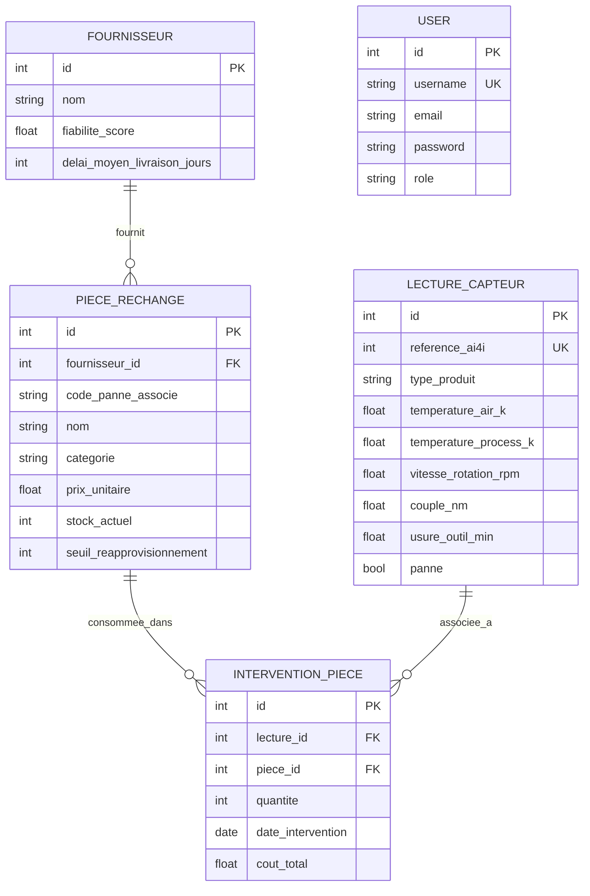

# Modèle de données — MCD/MPD (C4)

Le MPD réel est produit par les migrations Django (`src/backend/*/migrations/0001_initial.py`), qui font foi car exécutées telles quelles en base. Ce document en donne une vue lisible pour la soutenance, ainsi que sa contrepartie SQL indépendante (`src/sql/schema.sql`).

## Schéma relationnel

`USER` n'a pas de relation directe avec les autres entités (aucune donnée de maintenance n'est rattachée à un utilisateur nommément — voir `docs/rgpd.md`, les interventions sont rattachées à des lectures capteur et des pièces, pas à des personnes).

## Entités et attributs

| Entité | Clé primaire | Clés étrangères | Attributs clés | Contraintes |
|---|---|---|---|---|
| `User` (`accounts.User`) | `id` | — | `username`, `email`, `password` (haché), `role` | `username` unique |
| `Fournisseur` (`inventory.Fournisseur`) | `id` | — | `nom`, `fiabilite_score`, `delai_moyen_livraison_jours` | `delai_moyen_livraison_jours` ≥ 0 |
| `PieceRechange` (`inventory.PieceRechange`) | `id` | `fournisseur_id` → `Fournisseur` (`PROTECT`) | `code_panne_associe`, `categorie`, `prix_unitaire`, `stock_actuel`, `seuil_reapprovisionnement` | `prix_unitaire` > 0, `stock_actuel` ≥ 0 |
| `LectureCapteur` (`maintenance.LectureCapteur`) | `id` | — | `reference_ai4i`, mesures capteur, `panne` + 5 modes de panne (booléens) | `reference_ai4i` unique |
| `InterventionPiece` (`maintenance.InterventionPiece`) | `id` | `lecture_id` → `LectureCapteur` (`CASCADE`, nullable), `piece_id` → `PieceRechange` (`PROTECT`) | `quantite`, `date_intervention`, `cout_total` | `quantite` > 0, `cout_total` ≥ 0 |

`PROTECT` sur les clés étrangères métier : empêche de supprimer un fournisseur ou une pièce encore référencés ailleurs — intégrité référentielle explicite, pas une suppression en cascade non maîtrisée.

## Deux preuves indépendantes

1. **MPD réel** : migrations Django (`0001_initial.py` de chaque app), exécutées en base à chaque `python manage.py migrate` — c'est littéralement le schéma qui tourne en production.
2. **Schéma SQL indépendant** (`src/sql/schema.sql`) : reprend les 3 entités centrales (fournisseurs, pièces, interventions) avec les mêmes contraintes exprimées en `CHECK` SQL pur, utilisé pour vérifier `analysis_queries.sql` hors du contexte Django (C2).

## Justification du choix de base

PostgreSQL en production (`docker-compose.yml`) — robustesse et gestion de la concurrence en environnement conteneurisé. SQLite en local et en CI — zéro configuration, démarrage instantané, suffisant pour le volume du projet (10 025 lignes). Bascule automatique via la variable d'environnement `DATABASE_URL` (`dj-database-url`), sans changement de code entre les deux environnements.
